## 3D Object Detection in Waymo's Lidar Dataset using Deep Learning
This is a student project in [Udacity Self-Driving Car Engineer Nanodegree Program](https://www.udacity.com/course/self-driving-car-engineer-nanodegree--nd0013). 
A deep-learning based approach is used to detect vehicles in LiDAR data based on a birds-eye view Maps of the 3D point-clouds. In first step pretrained object detection model from an open source implementation is integrated in our detection framework and later I have customised data loading pipeline(in Pytorch) for training this model (from cloned repository) on Waymo's perception/Lidar dataset.
Also, Performance evaluation is done by computing Average precision & mAP metrics.

### Waymo Open Perception Dataset

Lidar data from 360 degree Lidar mounted on vehicle's top is used. you can visit https://waymo.com/intl/en_us/open/data/perception/#lidar-data,  https://waymo.com/intl/en_us/open/data/perception/#3d-bounding-boxes to familiarise yourself with Waymos's Lidar sensors,datarecords,frame structures & 3D labels.<br>
<br>
   <br>
  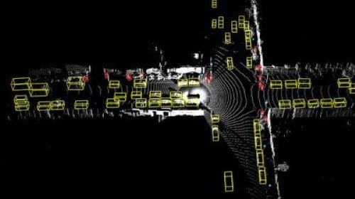

### Pretrained Models
The ResNet-based Keypoint Feature Pyramid Network (KFPN) was proposed in RTM3D paper.https://arxiv.org/pdf/2001.03343.pdf. The open source implementation of this network from https://github.com/maudzung/SFA3D is used in this project. This model is shipped pretrained on KITTI Lidar data.
For technical details on network architecture /model implementation please refer to https://github.com/maudzung/SFA3D/blob/master/Technical_details.md

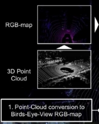    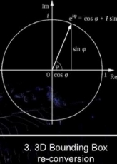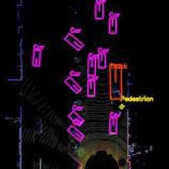


- **Input**: 
    - The model takes a birds-eye-view (BEV) map as input. 

    **Outputs**: 
    - Heatmap for main center 
    - Center offset
    - The heading angle _(yaw)_complex angle img & real
    - Dimension _(h, w, l)_
    - z coordinate: 

- **Targets**: **7 degrees of freedom** _(7-DOF)_ of objects: `(cx, cy, cz, l, w, h, θ)`
   - `cx, cy, cz`: The center coordinates.
   - `l, w, h`: length, width, height of the bounding box.
   - `θ`: The heading angle in radians of the bounding box.


### Project File Structure

📦project<br>
 ┣ 📂dataset --> contains waymo dataset- testing sequences <br>
 ┣ loop_over_dataset.py --> main script for processing waymo test sequences/frames <br>
 ┣ 📂misc<br>
 ┃ ┣ evaluation.py --> plot functions for visualization<br>
 ┃ ┣ helpers.py --> misc. helper functions, e.g. for loading / saving binary files<br>
 ┃ ┗ objdet_tools.py --> object detection helper functions<br>
 ┣ 📂student <br>
 ┃ ┣ objdet_detect.py --> model's inference/testing mode for object detection<br>
 ┃ ┣ objdet_eval.py --> comparing detections to ground Labels.saving precision,recall values to csv file for plotting  <br>
 ┃ ┣ objdet_pcl.py --> point cloud to BEV map conversion, preprocessing Point clouds using Open3D <br>
 ┃ ┣ plotting_precision_recall_curves <br>
 ┣ 📂tools --> external tools<br>
 ┃ ┣ 📂objdet_models --> models for object detection<br>
 ┃ ┃ ┃<br>
 ┃ ┃ ┣ 📂darknet<br>
 ┃ ┃ ┃ ┣ 📂config<br>
 ┃ ┃ ┃ ┣ 📂models --> darknet / yolo model class and tools<br>
 ┃ ┃ ┃ ┣ 📂pretrained --> copy pre-trained model file here<br>
 ┃ ┃ ┃ ┃ ┗ complex_yolov4_mse_loss.pth<br>
 ┃ ┃ ┃ ┣ 📂utils --> various helper functions<br>
 ┃ ┃ ┃<br>
 ┃ ┃ ┗ 📂resnet<br>
 ┃ ┃ ┃ ┣ 📂models --> fpn_resnet model class and tools<br>
 ┃ ┃ ┃ ┣ 📂pretrained --> copy pre-trained model file here <br>
 ┃ ┃ ┃ ┃ ┗ fpn_resnet_18_epoch_300.pth <br> 
 ┃ ┃ ┃ ┣ 📂utils -->model helper functions<br>
 ┃ ┃ ┃<br>
 ┃ ┗ 📂waymo_reader --> package for loading of Waymo sequences<br>
 ┣ 📂logs --> tensorboard logs of model training on waymo training sequences <br>
 ┣ 📂training_on_waymo_data --> custom dataloading scripts for training cloned model with waymo training & validation data <br>
 ┃ ┣ waymo_dataloader.py<br>
 ┃ ┣ waymo_dataset.py<br>
 ┃ ┣ waymo_extract_BEV_labels_from_training_data.py<br>
 ┃ ┣ train_waymo.py<br>
 ┃ ┣ train_waymo_config.py<br>
   


### Installation Instructions for Running Locally
#### Cloning the Project
In order to create a local copy of the project, please click on "Code" and then "Download ZIP". Alternatively, you may of-course use GitHub Desktop or Git Bash for this purpose. 

#### Python
The project has been written using Python 3.7. Please make sure that your local installation is equal or above this version. 

#### Package Requirements
All dependencies required for the project have been listed in the file `requirements.txt`. You may either install them one-by-one using pip or you can use the following command to install them all at once: 
`pip3 install -r requirements.txt` 

#### Waymo Open Dataset Reader
The Waymo Open Dataset Reader is a very convenient toolbox that allows you to access sequences from the Waymo Open Dataset without the need of installing all of the heavy-weight dependencies that come along with the official toolbox. The installation instructions can be found in `tools/waymo_reader/README.md`. 

#### Waymo Open Dataset Files
I used the below mentioned testing sequence from waymo test dataset to evaluate performance of object detector

- `testing_segment-10084636266401282188_1120_000_1140_000_with_camera_labels.tfrecord`

Also for training the model,I tried following training & validation sequences. 

- Sequence 1 : `training_segment-1005081002024129653_5313_150_5333_150_with_camera_labels.tfrecord`
- Sequence 2 : `training_segment-10072231702153043603_5725_000_5745_000_with_camera_labels.tfrecord`
- Sequence 3 : `training_segment-10963653239323173269_1924_000_1944_000_with_camera_labels.tfrecord`
- Sequence 3 : `validation_segment-10203656353524179475_7625_000_7645_000_with_camera_labels.tfrecord`


To download these files, you will have to register with Waymo Open Dataset first: [Open Dataset – Waymo](https://waymo.com/open/terms)
 please [click here](https://console.cloud.google.com/storage/browser/waymo_open_dataset_v_1_2_0_individual_files) to access the Google Cloud Container that holds all the sequences. 
The sequences listed above can be found in  "training", "validation" and "testing" folders respectively. Please download them and put the `tfrecord`-files into the `dataset` folder of this project.

#### Pretrained Model Installation
The object detection methods used in this project use pre-trained models which have been provided by the original authors.They can be downloaded [here](https://drive.google.com/file/d/1Pqx7sShlqKSGmvshTYbNDcUEYyZwfn3A/view?usp=sharing) (darknet) and [here](https://drive.google.com/file/d/1RcEfUIF1pzDZco8PJkZ10OL-wLL2usEj/view?usp=sharing) (fpn_resnet). Once downloaded, please copy the model files into the paths `/tools/objdet_models/darknet/pretrained` and `/tools/objdet_models/fpn_resnet/pretrained` respectively.


#### External Dependencies
Parts of this project are based on the following repositories: 
- [Simple Waymo Open Dataset Reader](https://github.com/gdlg/simple-waymo-open-dataset-reader)
- [Super Fast and Accurate 3D Object Detection based on 3D LiDAR Point Clouds](https://github.com/maudzung/SFA3D)
- [Complex-YOLO: Real-time 3D Object Detection on Point Clouds](https://github.com/maudzung/Complex-YOLOv4-Pytorch)


#### License
[License](LICENSE.md)

### Data Preparation and Preprocessing

#### 1. Extracting Point-Clouds from Range Images

Waymo stores Lidar data as range images which are like 360 degree panoramic view of environment. Each pixel position corresponds to a direction & elevation around the ego car/sensor and stores range of laser reflections coming from that direction.First a transformation from spherical coordinates to cartesian coordinates  is done using lidar calibration data to extract point cloud .In second step
lidar points are transformed from lidar frame to Vehicle's coordinate frame.

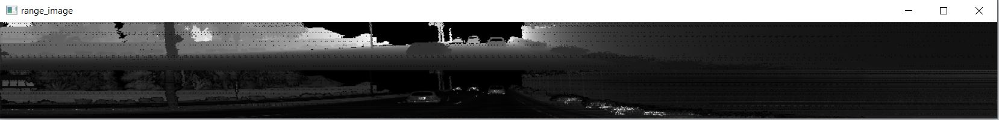

#### 2. Preprocessing Point-Clouds
For object detection we define a region of interest around the car. 50m to the front of car (x-axis), 25m to the left and right side (y-axis) &  -1m to 3m in z direction.

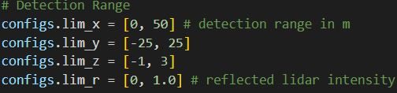


The input point cloud needs to be filtered and cropped. Also the road plane needs to be shifted to account for road inclination & slope.

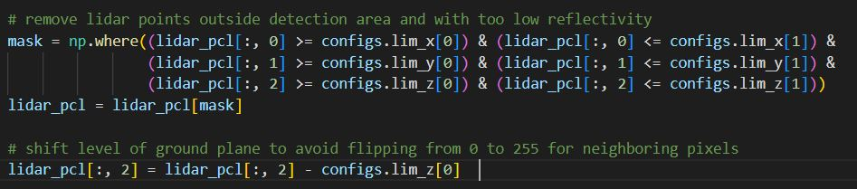

Resulting point cloud

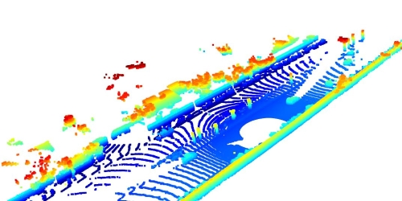                


#### 3. Create Birds Eye View from Point cloud

Deep learning model takes BEV map as Input for further processing.3D point cloud is converted into BEV by compacting it along upward facing z axis.BEV is divided into grid consisting of equally sized cells, where each cell/pixel corresponds to a region on road surface.several points can fall into same grid cell,depending on resolution of BEV map. The size of BEV Map depends on the input image size that model/network expects.


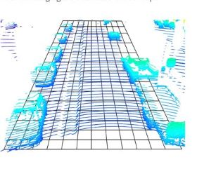                 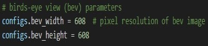

Step 1 : Descritize the grid cells and convert point coordinates from metric vehicle space to BEV pixel coordinate space. Each 3D point now has a grid cell/pixel coordinate (i,j) in BEV map. BEV size of 608 X 608 results in spatial resolution of ~ 8cm.

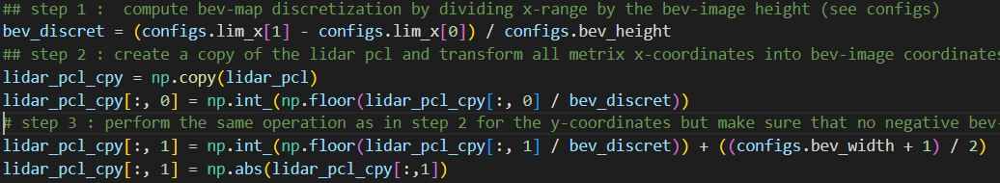

Step 2 : BEV map has 3 channels.height, density and intensity. We have to compute these values for each pixel of BEV map and then convert them into 8 bit integers(0-255). As described in original paper we can use following formulas's to encode the height, density and intensity of lidar points in given BEV cell.

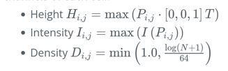

As can be seen below, height channel is brighter in regions with taller objects in the scene.eg. car roof,trees etc.
density channel can seperate edges strongly as most reflections come from sides, back of the objects in the scene
Intensity channel is stronger from highly reflective & metallic objects like tail lights, traffic signs,number plates etc. 

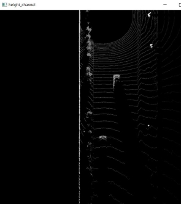 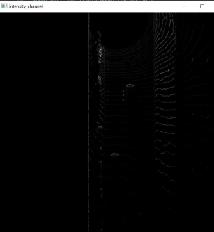 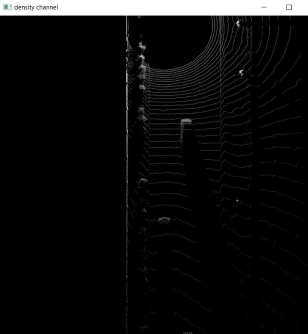

Step 3: BEV map can be assembled by combining these 3 channels.

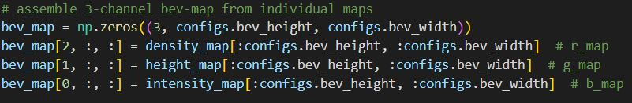 
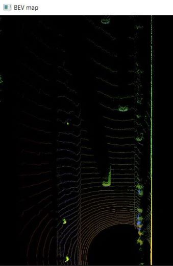 


### Model-based Object Detection

Step 1 : Integrate the pretrained model inside our testing/inference framework. 

Using the original repository https://github.com/maudzung/SFA3D ,particularly the test.py file,you can extract the relevant model configurations from 'parse_test_configs()' and added them in the 'load_configs_model' config dictionary inside our objdet_detect.py file.

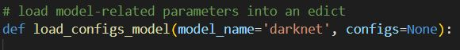 
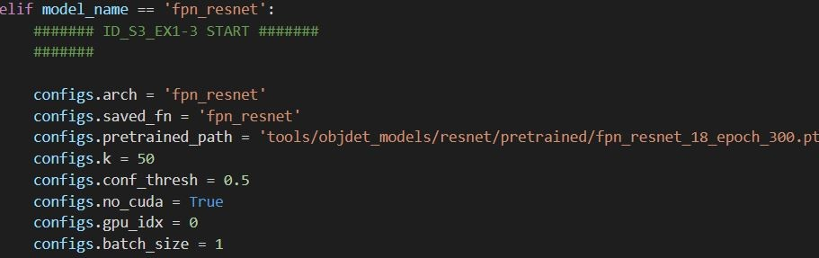 

Step 2: Instantiating the fpn resnet model and load the pretrained model state_dict/ weights.

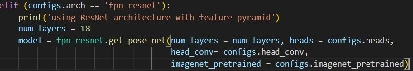
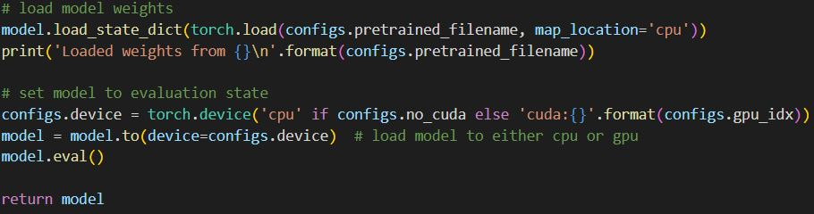

Step 3 : Decode and postprocess model output to get object list as 3D bounding boxes.

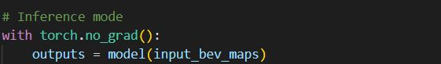

Transform the Model output tuned to the bounding box format [class-id, x, y, z, h, w, l, yaw]

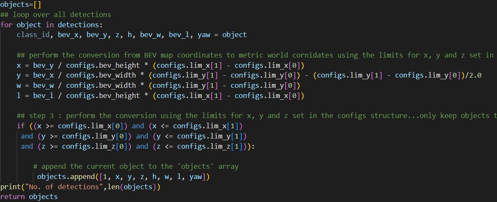

Output of the above task is as shown below:

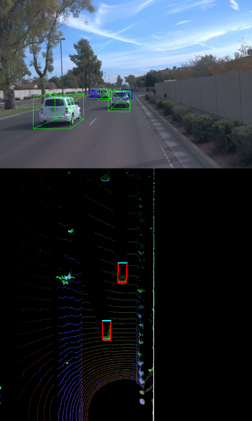


### Performance Evaluation of Object detector

we have to compare the ground-truth bounding box to the detected box.we use the Intersection over Union (IoU) as a similarity measure. It’s given by the area of the overlap divided by the size of the union of the two bounding boxes. IOU threshold determines if the detection is considered a True positive or False Positive. Normally IOU threshold ranges from 0.5 to 0.7 depending on application. IOU can be set as configuration parameter of our model


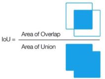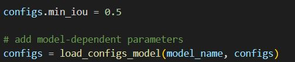

Step 1 : we find pairings between ground-truth labels and detections, later false negatives and false positives are computed to calculate precision and recall. After processing all the frames of test sequence, the performance of the object detection algorithm is evaluated. 

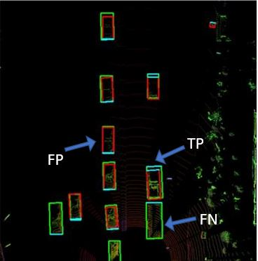                                     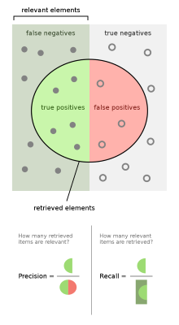<br>

Step 2: Precision-Recall Curve and Average Precision.

Precision and recall of our model on any test data depends on the Confidence threshold , which is basically the minimum confidence/belief model should have to mark the things it sees as a detection. If this confidence threshold is decreased model will output more objects as detections.
precision will decreaseand recall might increase.

Average precision is a metric that averages out model performance on a test dataset at diferent settings of confidence threshold.<br>
Mean Average Precision is then Average Precision calculated over a range of IOU thresholds. For eg. mAP@0.5:0.1:0.7 where 0.1 is step size.

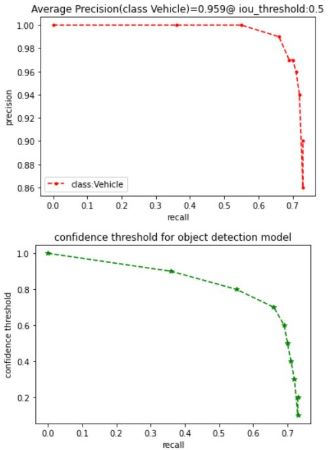                                                        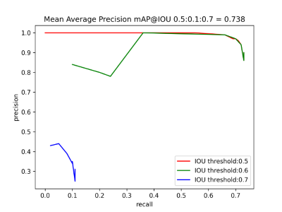

### Project Extension : How to Train FPN-Resnet model on Waymo Training data sequences.

Step 1: First you need to clone https://github.com/maudzung/SFA3D repository.Then copy the following files from 📂training_on_waymo_data folder of this project <br>
  waymo_dataloader.py<br>
  waymo_dataset.py<br>
  waymo_extract_BEV_labels_from_training_data.py<br>
  train_waymo.py<br>
  train_waymo_config.py<br>

  and add them in cloned repository at the location shown in below image
  Also add the downloaded waymo training & validation data sequences here.

  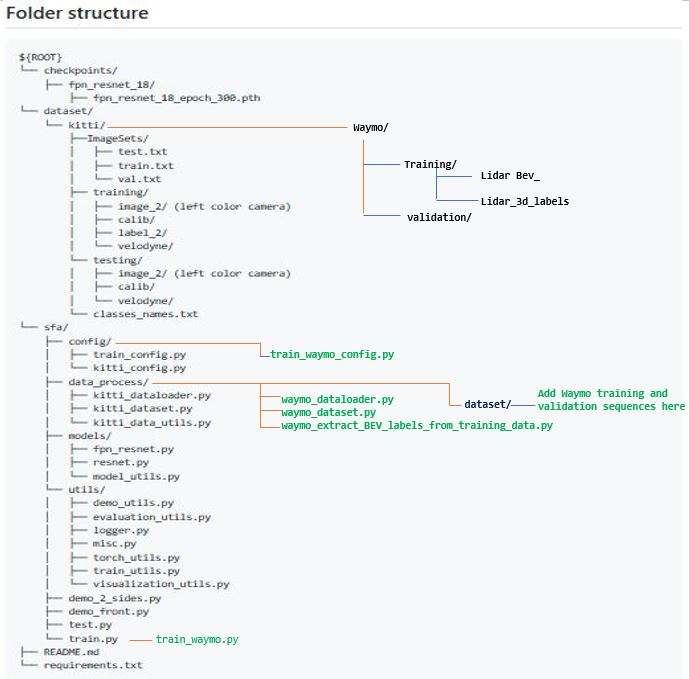

  Step 2: Extract the BEV Maps and Target Labels from a waymo training sequence for training this FPN resnet model.
  Select the individual data sequence you want to extract inside waymo_extract_BEV_labels_from_training_data.py file and then run this.

  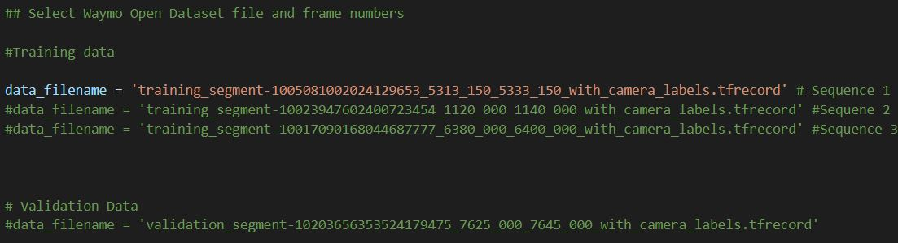

  Step 3: Set your training configuration/Hyperparameters inside train_waymo_config.py

  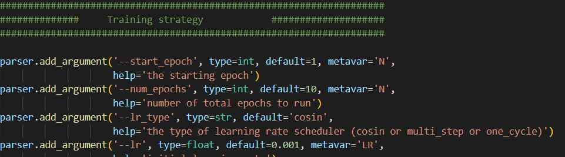

  Step 4: run train_waymo.py

  you should see something like this

  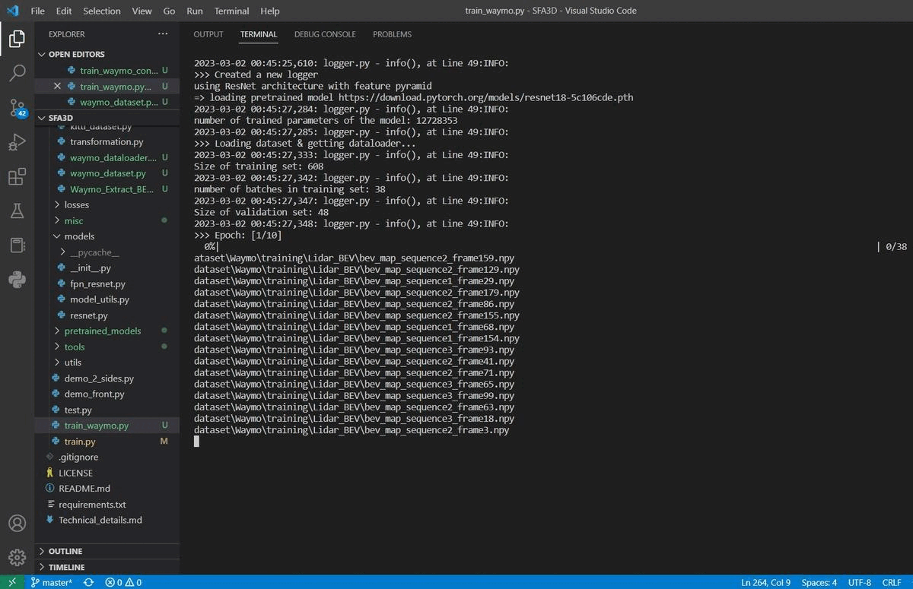

#### Tensorboard

- To track the training progress, go to the `logs/` folder and 

```shell script
cd logs/<saved_fn>/tensorboard/
tensorboard --logdir=./
```

- Then go to [http://localhost:6006/](http://localhost:6006/)

### Training Results:

I could monitor the training progress & losses on tensorboard , however we need more training data and download number of waymo training sequences from [here](https://console.cloud.google.com/storage/browser/waymo_open_dataset_v_1_2_0_individual_files) .Each sequence contains around 200 frames. Tensorboard log files are saved in logs directory of this project.

  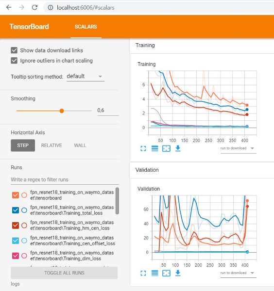

### Integration to object detection framework

After training you can integrate your model checkpoint following the same steps exactly as we did before for adding pretrained models

 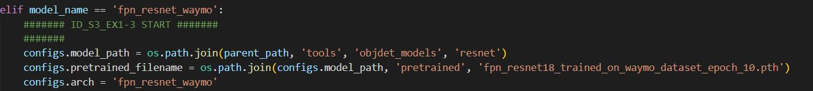
 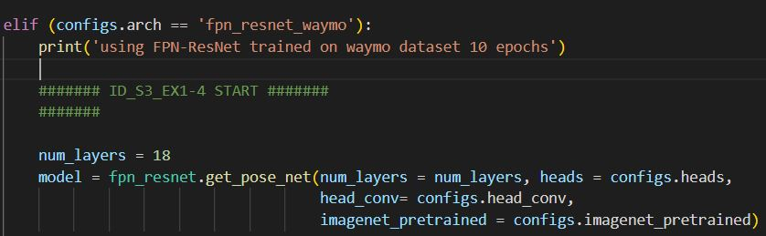

then finally select the model you want to use for object detection
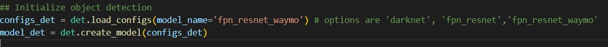


### Future work

Training FPN Resnet model using Waymo training data and fine tuning the performance over multiple test sequences.Also extend this to detecting multiple object classes in waymo dataset like pedestrians & bicyclist 


